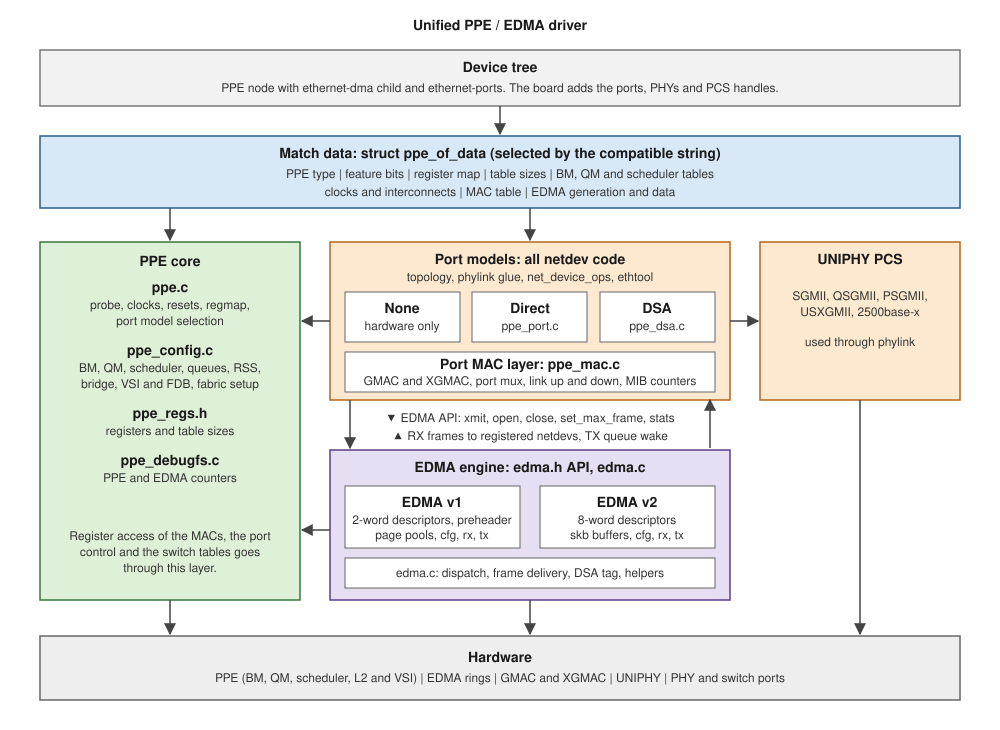

# Unified PPE/EDMA driver

Date: 2026-10-02.

## Summary

One kernel module, `qcom-ppe.ko`, drives the PPE and EDMA of every IPQ
family that has them. The IPQ Family table at the end of this file lists
the families and the PPE type of each. The board device tree describes
the hardware and the driver configures it at runtime.

- Each SoC has a compatible string and a `struct ppe_of_data` in its
  match data. The data holds the register layout, table sizes, BM, QM and
  scheduler tables, clocks, interconnects, the MAC table, the EDMA
  generation and the default port model.
- Each SoC has a PPE type, `enum ppe_type`: HPPE, CPPE, APPE or MPPE.
  The HPPE and the CPPE share one register map and the APPE and the MPPE
  share the other. The register map is a structure with the addresses and sizes of
  the registers that differ between the types, and the match data points
  to it. A feature that only some types have is a bit in the match data,
  and the code tests that bit. The match data of a SoC also holds what
  differs between SoCs: the tables and their sizes, the port count, the
  MAC table, the loopback port and the EDMA data. The EDMA version is
  independent of the PPE type.
- EDMA is the `ethernet-dma` child of the PPE node on every SoC. The PPE
  driver probes it. There is one platform driver.
- The port models own all netdev code. `ppe_port.c` handles the direct
  model and `ppe_dsa.c` handles the DSA model. Each creates its netdevs
  and runs ethtool. The two models share no netdev code. They share the
  EDMA API, whose caps and statistics layout each model reads to set up its
  netdevs, and the MAC layer.
- The MACs of the ports are handled by one layer, `ppe_mac.c`, that both
  port models call from their phylink operations. It sets up the clocks and
  resets of each port, selects the GMAC or the XGMAC with the port mux,
  brings the MAC up and down, sets the MAC address and reads the MIB
  counters. The differences between the SoCs are in the
  MAC table (`struct ppe_mac_data`) of the match data. The port models keep
  what is theirs: the phylink capabilities and the ports that have no MAC of
  this kind. Both models get the PCS of a port from
  `ppe_mac_pcs_get()`, which calls `qca_uniphy_pcs_get()` with the UNIPHY and
  the channel of the `pcs-handle` property. Every SoC uses the same UNIPHY
  driver.
- The switch fabric of the PPE is set up for either model. `ppe_config.c`
  has the shared steps:
  `ppe_port_fabric_setup()` sets the spanning tree state, learning and
  counters of a port, and `ppe_user_port_setup()` gives a user port its VSI.
  The DSA model puts all user ports in VSI 0 and creates a VSI for each
  bridge. The direct model calls `ppe_direct_fabric_init()`, which gives each
  port a VSI of its own with the CPU port, so the ports are isolated and a
  bridge is a software bridge. The loopback port and the port mux are set up
  by `ppe_mac_lpbk_init()` and `ppe_mac_pcs_mux_init()`.
- EDMA is a datapath provider behind a fixed API declared in `edma.h`.
  It moves frames between memory and the PPE. It creates no user visible
  netdev. `edma.c` dispatches each call to the v1 (2-word descriptors) or
  v2 (8-word descriptors) implementation by the generation in the match
  data. The rest of the driver sees one engine. A table of function
  pointers can replace the dispatch later without changing any caller.
- The port models call the EDMA API and register their netdevs with
  EDMA. EDMA delivers received frames to the registered netdevs and wakes
  their TX queues. There are no callbacks.
- EDMA has one option for the frame format: the tag mode, given to
  `edma_init()`. In DSA mode EDMA inserts the DSA tag on receive and
  removes it on transmit. In the other mode it does neither. The code
  is in `edma.c` and serves both generations.
- The port model is chosen from the device tree. A port with an
  `ethernet` phandle selects DSA. Ports without it select the direct
  model. No port nodes select hardware-only forwarding.

## Block diagram

## How it works

Probe:

    qcom_ppe_probe()
      read ppe_of_data from the match data
      ppe_hw_config()                    PPE registers
      ppe_mac_init()                     clocks, resets and MAC setup of each port
      select the port model              from the ports in the device tree
      edma_init(config)                  pick the generation, tag mode, hw_init
      attach the port model
        direct: for each port -> alloc netdev, register, phylink,
                                 edma_register_netdev(port_id, netdev)
        dsa:    conduit netdev -> register, edma_register_netdev(port 0),
                                 then dsa_register_switch()
        (both use ppe_mac_get(port) from their phylink operations)

Transmit:

    ndo_start_xmit (ppe_port.c or ppe_dsa.c)
      edma_xmit(skb, dst_port, txq)      in edma.c, before the dispatch:
                                           DSA mode: read the destination port
                                                     from the tag
                                         the implementation removes the tag once
                                         it accepts the frame and chooses the
                                         ring from txq
    TX completion (NAPI in EDMA) -> free the skb -> wake the TX queue
                                    of the registered netdev

Receive:

    NAPI in EDMA -> build the skb, set hash and checksum status
               -> edma_rx_deliver(napi, skb, src_port)   in edma.c
      look up the netdev: the one registered as port 0 in DSA mode and the
                          one registered for the source port otherwise
      DSA mode: insert the tag from the source port
      count the frame in the netdev per-CPU statistics
      set skb->dev, eth_type_trans(), napi_gro_receive()

Open and close:

    ndo_open  -> edma_open()             reference counted, the first open starts the rings
    ndo_stop  -> edma_close()

MTU change:

    ndo_change_mtu -> largest frame across the netdevs
      edma_pause()                       NAPI and interrupts off
      stop the TX queues of the netdevs
      edma_set_max_frame()               rebuild buffers and rings
      edma_resume()
      wake the TX queues

## File layout

    drivers/net/ethernet/qualcomm/ppe/          qcom-ppe.ko, one platform_driver
    |
    |-- Kconfig, Makefile
    |-- ppe.c / ppe.h                   Probe. Match data (struct ppe_of_data), clocks, resets,
    |                                   regmap, port model selection, edma_init(), model attach
    |-- ppe_regs.h                      Register addresses and table sizes
    |-- ppe_config.c / ppe_config.h     BM, QM, scheduler, queues, RSS, bridge, VSI/FDB and the
    |                                   fabric setup of the legacy switch. Per-SoC tables live
    |                                   here
    |-- ppe_debugfs.c / ppe_debugfs.h   PPE counters and the EDMA statistics, one file per
    |                                   stats group, generated from stats_layout
    |
    |-- ppe_mac.c / ppe_mac.h           Port MACs, shared by both models: clocks and resets of each
    |                                   port, GMAC / XGMAC setup, port mux, link up and down, MAC
    |                                   address, MIB counters of the GMAC and the XGMAC (ethtool
    |                                   and netdev statistics), loopback port and port 3 mux
    |                                   setup. struct ppe_mac_data is the per-SoC table
    |
    |-- ppe_port.c / ppe_port.h         Direct model: topology parse, phylink glue and PCS, netdev
    |                                   per port, net_device_ops, ethtool. The MAC is ppe_mac.c
    |-- ppe_dsa.c / ppe_dsa.h           DSA model: switch ops, VSI/FDB use, phylink glue and PCS,
    |                                   conduit netdev, net_device_ops, MTU policy, ethtool and
    |                                   the MAC counters of the user ports. The MACs are
    |                                   ppe_mac.c
    |
    |-- edma.h                          The EDMA API used by the rest of the driver: edma_caps,
    |                                   edma_config, edma_stat_desc,
    |                                   struct edma and the function prototypes
    |-- edma.c                          Dispatch of each API call to edmav1 or edmav2 by the
    |                                   generation, open/close reference count, netdev table,
    |                                   RX frame delivery, DSA tag insert and remove, and the
    |                                   helpers both implementations use:
    |                                   clock and reset handling, IRQ lookup and request by
    |                                   name, regmap and base offset, dummy netdev. The misc IRQ
    |                                   handler and the global registers are in each generation,
    |                                   because their counters and registers differ
    |
    |-- edmav1/                         EDMA v1: 2-word descriptors
    |   |-- edma.c / edma.h             init, fini, open, close, pause, resume, set_max_frame,
    |   |                               stats_layout, stats_read, page pools, SoC quirks
    |   |-- cfg_rx.c / cfg_rx.h         RX ring config, rxfill handling
    |   |-- cfg_tx.c / cfg_tx.h         TX ring config
    |   |-- rx.c / rx.h                 RX datapath with preheader, calls edma_rx_deliver()
    |   `-- tx.c / tx.h                 TX datapath with preheader, xmit, completion
    |
    `-- edmav2/                         EDMA v2: 8-word descriptors
        |-- edma.c / edma.h             init, fini, open, close, pause, resume, set_max_frame,
        |                               stats_layout, stats_read
        |-- cfg_rx.c / cfg_rx.h         RX ring config, PPE queue mapping, RPS
        |-- cfg_tx.c / cfg_tx.h         TX ring config, TX completion mapping
        |-- rx.c / rx.h                 RX datapath, calls edma_rx_deliver()
        `-- tx.c / tx.h                 TX datapath, xmit, completion

    arch/arm64/boot/dts/qcom/
    |-- <soc>.dtsi or <soc>-ppe.dtsi    PPE node, ethernet-dma child, ethernet-ports
    `-- <board>.dts                     Ports, PHYs, PCS handles, labels

## Device tree format

The SoC `.dtsi` defines the PPE node with the `ethernet-dma` child and an
empty `ethernet-ports` container. The board `.dts` adds the ports. All
SoCs use the same node and property names. Only the values and the
optional properties differ.

SoC `.dtsi`:

    ppe: ethernet-switch@3a000000 {
        compatible = "qcom,<soc>-ppe";
        reg = <... 0x3a000000 ... <window>>;    /* covers the EDMA registers */
        clocks = <core clocks>;
        clock-names = "ppe", "apb", "ipe", <SoC extras>;
        resets = <PPE full reset>;
        interrupts = <misc>;                  /* optional */
        interconnects = <...>;                /* optional */
        interconnect-names = <...>;
        status = "disabled";

        edma: ethernet-dma {
            clocks = <edma sys>, <edma apb>;
            clock-names = "sys", "apb";
            resets = <edma reset>;
            interrupts = <named ring interrupts>;
            interrupt-names = "txcmpl_N", "rxfill_N", "rxdesc_N", "misc";
        };

        ethernet-ports {
            #address-cells = <1>;
            #size-cells = <0>;
            /* one node per port, added by the board file */
        };
    };

The match data from the compatible defines the ring layout, register
offsets, tables and EDMA generation. The device tree does not carry them.

Board `.dts`, direct model. Each port is a netdev:

    &ppe {
        status = "okay";
        ethernet-ports {
            ethernet-port@1 {
                reg = <1>;
                phy-mode = "qsgmii";
                phy-handle = <&phy0>;
                pcs-handle = <&pcsuniphy0_ch0>;
                clocks = ...;  clock-names = "mac", "rx", "tx";
                resets = ...;  reset-names = "mac", "rx", "tx";
                label = "lan1";
            };
        };
    };

Board `.dts`, DSA model. `ethernet-port@0` is the CPU port. Its
`ethernet` phandle selects the DSA model and its `label` names the
conduit netdev:

    &ppe {
        status = "okay";
        ethernet-ports {
            ethernet-port@0 {
                reg = <0>;
                ethernet = <&edma>;
                label = "imp0";
                phy-mode = "internal";
                fixed-link { speed = <1000>; full-duplex; };
            };
            switch_port1: ethernet-port@1 {
                reg = <1>;
                phy-mode = "psgmii";
                phy-handle = <&qca8075_0>;
                pcs-handle = <&uniphy0 0>;
                clocks = ...;  clock-names = "mac", "rx", "tx";
                resets = ...;
                label = "eth1";
            };
        };
    };

The port model rule is:

| Ports in the device tree | Model |
|---|---|
| One port has an `ethernet` phandle | DSA |
| Ports exist and none has the phandle | Direct |
| No port nodes | None (hardware-only forwarding) |

## The port MAC layer

Each port with clocks in its node has a `struct ppe_mac`. The port models call
these functions from their phylink operations:

    int   ppe_mac_init(struct ppe_device *ppe);              /* at probe: clocks, resets, MAC init */
    struct ppe_mac *ppe_mac_get(struct ppe_device *ppe, unsigned int port);
    int   ppe_mac_prepare(mac, mode, interface);             /* port mux */
    void  ppe_mac_config(mac, mode, interface);              /* MAC type, reset */
    void  ppe_mac_link_up(mac, mode, interface, speed, duplex, tx_pause, rx_pause);
    void  ppe_mac_link_down(mac, mode, interface);
    int   ppe_mac_set_address(mac, addr);
    void  ppe_mac_lpbk_init(struct ppe_device *ppe);         /* loopback port, legacy fabric */
    void  ppe_mac_pcs_mux_init(struct ppe_device *ppe);      /* port 3 and PCS channel 4 */
    /* MIB counters */
    int   ppe_mac_get_sset_count(mac, sset);
    void  ppe_mac_get_strings(mac, stringset, data);
    void  ppe_mac_get_ethtool_stats(mac, data);
    void  ppe_mac_get_stats64(mac, stats);

The clocks and resets of a port are named `mac`, `rx` and `tx`. Each is
optional. The rates of the `rx` and `tx` clocks follow the link speed.

Link down and link up keep an order that the hardware needs:

    link down:  stop the fabric from feeding the port (BRIDGE_CTRL TXMAC_EN off)
                let the egress path drain
                stop the MAC (the XGMAC of some SoCs is looped back first)
    link up:    speed, duplex and pause of the MAC
                clock rates
                enable the MAC
                flow control of the buffer manager port (some SoCs)
                let the fabric feed the port

The table of the SoC, `struct ppe_mac_data`, has these values:

| Field | Meaning |
|---|---|
| `xgmac_addr`, `xgmac_stride`, `xgmac_first_port`, `xgmac_ports` | Where the XGMACs are and which ports have one |
| `mux` | Layout of the port mux register |
| `reset_delay_ms` | Time that the reset of a MAC is asserted for |
| `gmac_2500` | The GMAC handles 2500base-x without in-band autonegotiation |
| `xgmac_init` | The XGMACs are set up at probe time and not at link configuration |
| `xgmac_lpbk_drain` | The XGMAC transmitter is looped back to drain the egress path |
| `mib` | The MACs have MIB counters |
| `bm_flow_control` | The flow control of the buffer manager port follows the TX pause |

A port model calls the layer only for the ports that have a MAC. The DSA
model does not call it for the CPU port and the loopback port, which are
internal.

## The EDMA API

The port models use EDMA only through the definitions in `edma.h`.

    /* Statistics groups. ethtool shows PORT and GLOBAL. debugfs shows all. */
    enum edma_stat_group {
        EDMA_STAT_GLOBAL,
        EDMA_STAT_PORT,
        EDMA_STAT_RX_RING,
        EDMA_STAT_TX_RING,
        EDMA_STAT_ERR,
    };

    struct edma_stat_desc {
        const char           *name;
        enum edma_stat_group  group;
        u16                   index;      /* ring or port index, when it applies */
    };

    /* Filled by the implementation at init. The port model reads it to set up
     * each netdev. */
    struct edma_caps {
        unsigned int  rx_queues;          /* netdev RX queue count */
        unsigned int  tx_queues;          /* netdev TX queue count */
        unsigned int  needed_headroom;    /* bytes the datapath needs in front of a frame */
        unsigned int  min_tx_frame;       /* 0 when there is no minimum */
        unsigned int  max_tx_segs;
        unsigned int  max_mtu;
        netdev_features_t features;       /* RXCSUM, HW_CSUM, SG, TSO, ... */
    };

    /* Frame format on the conduit. The DSA tag is the 4-byte tag of
     * DSA_TAG_PROTO_DSA. The mode must match the tag protocol that the DSA
     * driver returns from get_tag_protocol. */
    enum edma_tag_mode {
        EDMA_TAG_NONE,                    /* frames carry no tag (direct model) */
        EDMA_TAG_DSA,                     /* RX: insert the tag from the source port.
                                           * TX: remove the tag, take the destination
                                           * port from it (DSA model) */
    };

    struct edma_config {
        enum edma_tag_mode  tag_mode;
    };

    /* Generation selected from the match data. */
    enum edma_gen { EDMA_NONE, EDMA_V1, EDMA_V2 };

    /* Lifecycle */
    int   edma_init(struct ppe_device *ppe, const struct edma_config *cfg,
                    struct edma **edmap);   /* registers, rings, page pools, IRQs,
                                             * dummy netdev, NAPI. No traffic yet */
    void  edma_fini(struct edma *edma);
    int   edma_register_netdev(struct edma *edma, u8 port_id,
                               struct net_device *netdev);   /* RX target of a port. The
                                                              * netdev counts its traffic
                                                              * with the per-CPU tstats */
    void  edma_unregister_netdev(struct edma *edma, u8 port_id);
    int   edma_open(struct edma *edma);    /* enable NAPI, unmask IRQs, enable rings.
                                            * Reference counted in edma.c */
    void  edma_close(struct edma *edma);

    /* Datapath */
    netdev_tx_t edma_xmit(struct edma *edma, struct sk_buff *skb,
                    u8 dst_port,              /* PPE port id. Ignored in DSA mode, where
                                               * it comes from the tag */
                    u8 txq);                  /* queue from ndo_select_queue. Hardware
                                               * limits, ring choice, descriptors and
                                               * producer index are handled inside. The
                                               * netdev is skb->dev */
    int   edma_set_max_frame(struct edma *edma,
                             unsigned int frame_size);   /* largest frame from the MAC
                                                          * header to the end of the
                                                          * payload with two VLAN tags */
    void  edma_pause(struct edma *edma);      /* NAPI and interrupts off */
    void  edma_resume(struct edma *edma);

    /* Information */
    const struct edma_caps *edma_caps_get(struct edma *edma);
    const struct edma_stat_desc *edma_stats_layout(struct edma *edma, unsigned int *count);
    void  edma_stats_read(struct edma *edma, u64 *buf);   /* sums per-CPU counters */

    /* Used by the implementations only. The interrupts are named in the
     * ethernet-dma node. The request names stay valid for the life of the
     * device, and the tools that set the affinity search /proc/interrupts
     * for "edma_rxdesc" and "edma_txcmpl". */
    int   edma_irq_get(struct edma *edma, const char *fmt, ...);
    int   edma_irq_request(struct edma *edma, int irq, irq_handler_t handler,
                           void *dev_id, const char *fmt, ...);
    void  edma_rx_deliver(struct edma *edma, struct napi_struct *napi,
                          struct sk_buff *skb,
                          u8 src_port);       /* hash and checksum status are already
                                               * set on the skb */
    void  edma_tx_tag_strip(struct sk_buff *skb);   /* after the frame is accepted */

    /* Optional. Return -EOPNOTSUPP when the generation has no support. */
    int   edma_ringparam_get(struct edma *edma, struct ethtool_ringparam *rp);
    int   edma_ringparam_set(struct edma *edma, struct ethtool_ringparam *rp);
    int   edma_regs_len(struct edma *edma);
    void  edma_regs_dump(struct edma *edma, void *buf);

RX delivery and the tag code are in `edma.c`. The implementations call
`edma_rx_deliver()` for each finished frame. `edma_xmit()` reads the
destination port from the TX tag. An implementation removes the tag with
`edma_tx_tag_strip()` only after it has accepted the frame, because a frame
that it refuses is requeued as it was handed over.

Dispatch in `edma.c`:

    int edma_xmit(struct edma *edma, struct sk_buff *skb, u8 dst_port, u8 txq)
    {
        if (edma->tag_mode == EDMA_TAG_DSA && edma_tx_tag_dst_port(skb, &dst_port))
            goto drop;
        if (edma->gen == EDMA_V1)
            return edmav1_xmit(edma, skb, dst_port, txq);
        return edmav2_xmit(edma, skb, dst_port, txq);
    }

The generation is fixed for a boot, so a static key can replace the
comparison. The compiler removes the branch of an unused generation when
its Kconfig option is off.

Each implementation exports the same function names with its own prefix:
`edmav1_xmit()`, `edmav2_xmit()`, `edmav1_open()`, `edmav2_open()` and so
on. They are declared in `edmav1/edma.h` and `edmav2/edma.h`. Only
`edma.c` includes those headers.

A table of function pointers can replace the dispatch later. The change
is limited to `edma.c` and the two implementations. Callers use the API in
`edma.h` and do not change.

## IPQ Family

The PPE type is the version of the PPE hardware: HPPE, CPPE, APPE or MPPE.
None means that the family has no PPE. Not determined means that the
register definitions of the family have not been compared with those of
the four types.

| IPQ Family | Codename | PPE type | Notes: PPE and eDMA generation |
|---|---|---|---|
| IPQ96xx | JUHU / Tresells | Not determined | PPE: Evolved PPE architecture; NSS/NPU offload model. eDMA: JUHU-generation. Specific PPE/eDMA version details not explicitly documented in available sources. |
| IPQ54xx | MARINA | APPE | PPE: Shares PPE/eDMA lineage with IPQ53xx (Miami/Alder); IPQ5424 eDMA reap ring explicitly referenced alongside IPQ9574 and IPQ5332, confirming shared architecture. eDMA: MARINA-generation; same ring architecture as Alder/Miami. |
| IPQ95xx | Alder | APPE | PPE: Full-featured PPE — L2–L4 routing/bridging, 64k flows, 256 unicast + 44 multicast egress queues, 2-level scheduler, 3-level shaper, WRED lite, 25 Gbps / 37.5 Mpps. eDMA: "Alder" generation — txdesc, txcmpl, rxdesc, rxfill ring types; edma_dump alder; shared across all IPQ95xx SKUs. |
| IPQ53xx | Miami | MPPE | PPE: Supports Athtag Rx/Tx, vchannel backpressure via MDIO, EDMA ring IDs 0–15, VP/VLAN, PPE-VP Qdisc downlink. eDMA: "Miami" generation. |
| IPQ52xx | HERMOSA | Not determined | PPE: PPE-based architecture shared with IPQ50xx/IPQ60xx lineage (same SPF software platform). eDMA: HERMOSA-generation; part of the broader IPQ50xx/60xx PPE+eDMA platform family. Specific version not explicitly documented in available sources. |
| IPQ56xx | BELMAR | Not determined | PPE: PPE-based networking; part of the same IPQ50xx/60xx software platform family. eDMA: BELMAR-generation. Specific version details not explicitly documented in available sources. |
| IPQ60xx | Cypress | CPPE | PPE: Same PPE generation as IPQ50xx — hardware PPE drives Ethernet interfaces at line rate; up to 10 Gbps ingress classification; hardware QoS offload (egress queuing/shaping). eDMA: Cypress-generation; 3-layer pipeline (PPE → NPU/NSS-FW → A53); NSS-FW QoS diverts packets PPE → NPU → re-inject into PPE. |
| IPQ50xx | Maple | Not determined | PPE: Same PPE generation as IPQ60xx — PPE drives Ethernet at line rate; shared 3-layer data plane (PPE / NSS-FW / Linux). eDMA: Maple-generation; EDMA is the interface between PPE and ARM CPU; same pipeline architecture as IPQ60xx. |
| IPQ807x | Hawkeye / Hawkeye2 | HPPE | PPE: First generation of the Qualcomm hardware PPE with NSS/NPU offload; PPE handles L2–L4, ACL, policer, flow table, QoS at line rate; 3-layer pipeline (PPE / NPU / A53). eDMA: Hawkeye-generation; EDMA sits between PPE and CPU; same QoS offload model as IPQ60xx/IPQ50xx. |
| IPQ806x | Akronite | None | PPE: Pre-PPE-hardware era for this family; NSS with NPU offload; HNAT on select SKUs. eDMA: Akronite-generation; different architecture from the modern PPE+eDMA introduced in IPQ807x. Specific details not explicitly documented in available sources. |
| IPQ40xx | Dakota | None | PPE: No dedicated PPE hardware engine; uses HNAT (Hardware NAT) for offload. eDMA: Dakota-generation; no modern PPE-style eDMA ring architecture. Specific details not explicitly documented in available sources. |
